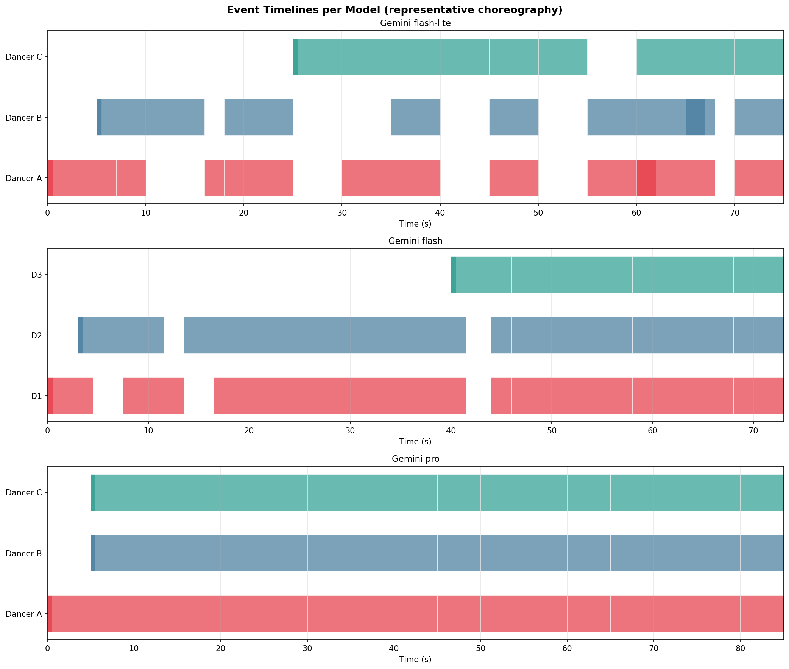
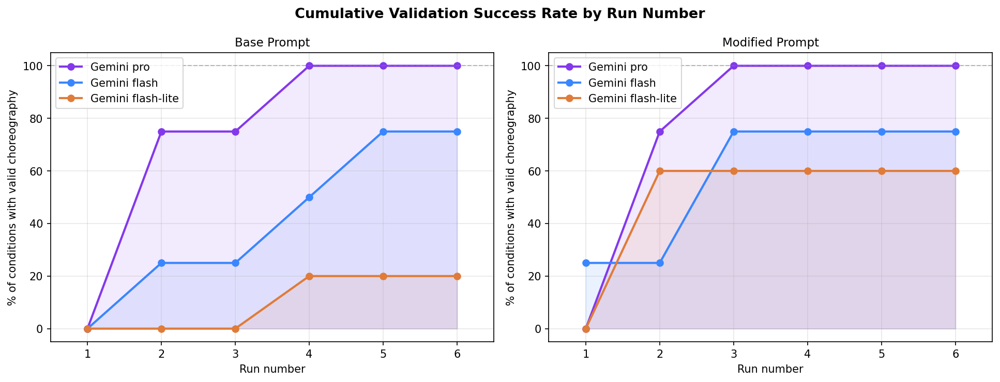

# 💃 Constraint-Based Creative Generation with AI — Dance Choreography

> Generating physically-plausible dance choreographies with Large Language Models,
> and studying how **creativity emerges under formal spatial and temporal constraints**.

This project explores the relationship between generative AI and formal constraints
through the task of **dance choreography generation**. Instead of treating creativity as
free-form novelty, it frames it as *structured generation under explicit rules*: an LLM
expresses a choreography in natural language, the system encodes it into a machine-readable
format, and a rule-based validator checks whether it is physically possible. A
**generate → validate → refine** loop then pushes the model toward valid, performable results.

---

## 🎯 Concept

In many creative domains, constraints are not obstacles — they are *generative*. They shrink
the solution space while shaping form and structure. This project makes those constraints
**explicit and inspectable** by cleanly separating two concerns:

| Layer | Responsibility | Form |
|-------|----------------|------|
| **Expressive generation** | Inventing the choreography | Natural language (LLM) |
| **Formal validation** | Checking it is physically possible | Deterministic Python rules |

A choreography is only accepted once it passes every constraint, mirroring established models
of creative cognition where artifacts are progressively refined by feedback rather than
produced in a single shot.

<p align="center">
  
</p>

*A generated choreography, visualized as per-dancer event timelines. Each bar is a
time-bounded movement on the 25×25 stage. Stronger models (bottom) produce continuous,
well-structured activity, while smaller models (top) tend toward fragmented, gap-heavy timing.*

---

## 🧠 Pipeline

The pipeline runs a **generate → validate → refine** loop:

1. **Choreography generation (natural language)** — 60–90 seconds, 2–5 dancers, with
   entrances/exits, movements, interactions, approximate timing and stage locations.
2. **Formal encoding (JSON)** — the stage is mapped onto a **25×25 grid**; movements become
   time-bounded events with explicit spatial transitions.
3. **Validation** — `validator.py` enforces the physical/temporal rules below.
4. **Iterative refinement** — on failure, the violations are fed back to the model as a
   correction prompt and the choreography is regenerated until it validates.

---

## ✅ The Validator (`validator.py`)

A dependency-free (stdlib-only) rule engine that interpolates each dancer's path across a
discrete timeline and checks:

| Constraint | Rule |
|------------|------|
| **Spatial boundaries** | Every position must stay within the 25×25 grid |
| **Collision avoidance** | No two active dancers may occupy the same cell at the same time |
| **Speed limit** | Movement per time-slot ≤ 4 cells (Chebyshev distance) |
| **Temporal coherence** | Valid enter/exit handling; implicit entries/exits flagged |
| **Reasonable activity** | Excessive stationary pauses (≥ 60 slots) are reported |

Run it standalone on any choreography JSON:

```bash
python validator.py valid_choreography/gemini-2.5-flash_temp_0.7_base_prompt.json
```

It prints a severity-tagged list of violations (`CRITICAL` / `HIGH` / `MEDIUM` / `INFO`)
and a machine-readable JSON report.

---

## 🔬 Experiments

The pipeline was run via API (no graphical interface) across a grid of conditions to study
how model choice, sampling temperature, and prompt design affect both **convergence**
(iterations needed to reach validity) and **creative variation**.

- **Models:** `gemini-2.5-flash-lite`, `gemini-2.5-flash`, `gemini-3-pro-preview`
- **Temperatures:** `0.01`, `0.1`, `0.3`, `0.7`, `1.0`
- **Prompt variants:** a **base** prompt and an improved **modified** prompt (refined after
  studying related work) — kept in separate experiment trees for direct comparison.

Every run is logged: the raw natural-language choreography, the validation trace, and a
`summary.txt` recording how many refinement iterations were required to reach a valid result.
**18 validated choreographies** are collected in `valid_choreography/`.

<p align="center">
  
</p>

*Cumulative validation success across refinement iterations. Each line tracks the share of
experimental conditions that reached a valid choreography by run **N**, for three Gemini
models under the base vs. improved prompt. Larger models converge faster and more completely,
and the improved prompt raises the success ceiling for the smaller models — evidence that
**both model capability and prompt design** shape constraint satisfaction.*

The comparative analysis discusses similarities and differences in spatial organization,
emergent motifs, and how constraints shape stylistic variation — visualized in `outputs/`:

| Figure | Shows |
|--------|-------|
| `fig1_timelines.png` | Dancer occupancy timelines |
| `fig2_error_breakdown.png` | Distribution of violation types per model/condition |
| `fig3_convergence.png` | Iterations-to-valid across models and temperatures |

---

## 📁 Repository Structure

```
.
├── creative_generation.ipynb     # Main pipeline: generate → encode → validate → refine
├── Analysis.ipynb                # Comparative analysis + figure generation
├── validator.py                  # Rule-based constraint validator (stdlib only)
├── requirements.txt
│
├── base_choreography_prompt/     # Runs using the original prompt
│   └── logs/<model>/<run>/        #   choreography.txt + summary.txt per run
├── modified_choreography_prompt/ # Runs using the improved prompt
│   └── logs/<model>/<run>/
│
├── valid_choreography/           # 18 final validated choreography JSON files
├── outputs/                      # Analysis figures + trajectory data
│
├── Report_Kusai_Aljuhmani.pdf    # Written report
└── Project_description.pdf        # Original assignment brief
```

### JSON choreography format

```jsonc
{
  "dancers": ["D1", "D2", "D3"],
  "duration": 85.0,
  "events": [
    {
      "id": 2,
      "dancer": "D1",
      "action": "walk (head bowed, arms curved)",
      "start": 0.0,
      "end": 5.0,
      "from": { "x": 0,  "y": 0 },
      "to":   { "x": 12, "y": 0 }
    }
  ]
}
```

Each event is a time-bounded movement; the validator interpolates a per-slot path between
`from` and `to` and checks it against every constraint.

---

## 🚀 Getting Started

This project uses [`uv`](https://github.com/astral-sh/uv) for environment management.

```bash
# 1. Clone
git clone https://github.com/KUSAI00/danceAI_project.git
cd danceAI_project

# 2. Create the virtual environment (Python 3.12) and install dependencies
uv venv --python 3.12
uv pip install -r requirements.txt

# 3. Activate
#   Windows (PowerShell):
.venv\Scripts\activate
#   macOS / Linux:
source .venv/bin/activate
```

**Dependencies:** `google-generativeai`, `huggingface_hub`, `matplotlib`, `numpy`, `ipykernel`.

### API keys

The generation notebook calls hosted LLMs, so you need to provide your own credentials
(e.g. as environment variables) before running the generation cells:

```bash
export GEMINI_API_KEY="your-key"          # Google AI Studio: https://aistudio.google.com
export HF_TOKEN="your-token"               # Hugging Face: https://huggingface.co/settings/tokens
```

> ℹ️ The notebooks use `google.generativeai`, which Google has since deprecated in favor of
> `google-genai`. It still runs (you'll see a `FutureWarning`); migrating is optional.

### Run it

- **`creative_generation.ipynb`** — runs the full generate/validate/refine pipeline for the
  chosen models and temperatures.
- **`Analysis.ipynb`** — aggregates the logged runs and reproduces the figures in `outputs/`.
- **`validator.py`** — validate any choreography JSON from the command line.

---

## 🛠️ Tech Stack

`Python 3.12` · `Google Gemini API` · `Hugging Face Inference API` · `NumPy` · `Matplotlib` · `uv`

---

## 📄 Report

A full write-up of the methodology, prompt engineering, results, and comparative analysis is
available in **`Report_Kusai_Aljuhmani.pdf`**.

---

## 👤 Author

**Kusai Aljuhmani** — Constraint-Based Creative Generation with AI.
